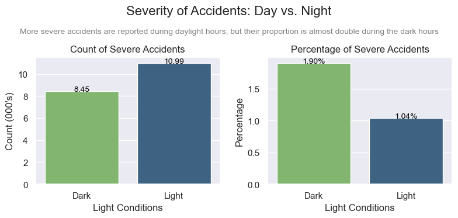
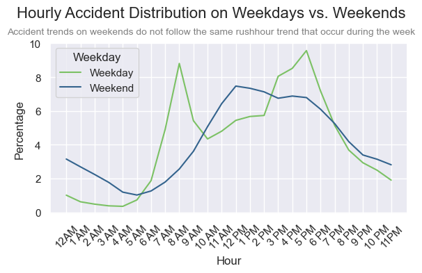
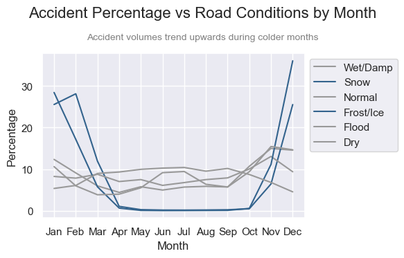
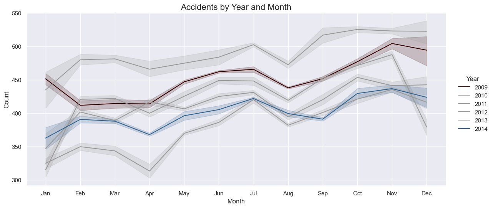

# UK Vehicle Accidents 
[Data Source](https://www.kaggle.com/datasets/devansodariya/road-accident-united-kingdom-uk-dataset)

## Overview

I found this dataset on Kaggle and thought it would provide a valuable opportunity to practice my data analysis skills. It's a large real world dataset where vehicle accidents display as individual rows. The datasets collection of columns allow for many areas of analysis (time series, regression, geospatial, etc.).

My primary goal with this project is to further develop and refine my Python programming skills.

## Initial cleaning

To analyse this data I've performed data transformation and cleaning to allow me to query it further.

<details>
<summary>EXPAND: Tweak Function created to clean and transform the Accident data</summary>

```python
# Creating a function to transform and clean the data as required for analysis.

def tweak_accidents(accidents):
   drop_columns = ["Unnamed: 0", 
                "Accident_Index",
                "Location_Easting_OSGR",
                "Location_Northing_OSGR",
                "Police_Force", 
                "Local_Authority_(District)", 
                "Local_Authority_(Highway)", 
                "1st_Road_Class",
                "1st_Road_Number", 
                "2nd_Road_Class",
                "2nd_Road_Number",
                "Year",
                "Did_Police_Officer_Attend_Scene_of_Accident",
                "LSOA_of_Accident_Location",
                "Junction_Control",
                "Pedestrian_Crossing-Human_Control",
                "Pedestrian_Crossing-Physical_Facilities"]
   
   return (accidents
      .rename(columns={"Speed_limit":"Speed_Limit"})
      .assign(
         Longitude=lambda df_: df_["Longitude"].astype("float32"),
         Latitude=lambda df_: df_["Latitude"].astype("float32"),
         Accident_Severity=lambda df_: df_["Accident_Severity"]
            .map({1: "Most Severe", 2: "Moderate Severity", 3: "Least Severe"})
            .astype("category"),
         Number_of_Vehicles=lambda df_: df_["Number_of_Vehicles"].astype("uint8"),
         Number_of_Casualties=lambda df_: df_["Number_of_Casualties"].astype("uint8"),
         Date=lambda df_: pd.to_datetime(df_["Date"]+" "+df_["Time"], format="%d/%m/%Y %H:%M"),
         Time=lambda df_: pd.to_datetime(df_["Time"], format="%H:%M").dt.time,
         Day_of_Week=lambda df_: df_["Day_of_Week"].astype("uint8"),
         Road_Type=lambda df_: df_["Road_Type"].astype("category"),
         Speed_Limit=lambda df_: df_["Speed_Limit"].astype("uint8"),
         Light_Conditions=lambda df_: df_["Light_Conditions"].astype("category"),
         Weather_Conditions=lambda df_: df_["Weather_Conditions"].astype("category"),
         Road_Surface_Conditions=lambda df_: df_["Road_Surface_Conditions"].astype("category"),
         Special_Conditions_at_Site=lambda df_: df_["Special_Conditions_at_Site"].astype("category"),
         Carriageway_Hazards=lambda df_: df_["Carriageway_Hazards"].astype("category"),
         Urban_or_Rural_Area=lambda df_: df_["Urban_or_Rural_Area"]
            .map({1: "Urban", 2: "Suburban", 3: "Rural"})
            .astype("category")
         )
      .drop(columns=drop_columns)
      .dropna()
      )
```

</details>

Creating this function will allow me to optimize memory usage. This results in quicker results when querying and allows for datatype-specific methods to be used. 

The query structure, based on method changing is inspired by Matt Harrison's book "Effective Pandas". This approach allows me to comment out code as I do, so that I can build the function incrementally and experiment to get the result I want.

## Exploration

I've created queries using Pandas and then displayed the results in plots using Seaborn and MatPlotLib.

While you can view the full notebook here: [Notebook](UK_Accident.ipynb), below are some examples of the transformations carried out on the data to plot the data.

<details>
   <summary>EXPAND: Accidents by day light</summary>

```python
## Plotting reported accidents count and percentage split by Day Light

day_light_accident_comparison = (accidents
 .groupby(["Day_Light", "Accident_Severity"])
 .size().div(1000)
 .reset_index(name="Count")
 .assign(
        Total_Count=lambda df_: df_.groupby("Day_Light")["Count"].transform("sum"),
        Percentage=lambda df_: ((df_["Count"] / df_["Total_Count"]) * 100).round(2))
 .drop(columns="Total_Count")
 .sort_values("Day_Light", ascending=False)
)

fig, axes = plt.subplots(1, 2, figsize=(8,4))

colors = (["#7bc164" if val == "Light" else "#33638d" 
           for val in day_light_accident_comparison
           .query('Accident_Severity == "Most Severe"')["Day_Light"]])

day_light_ct = (sns
.barplot(
    data=day_light_accident_comparison.query('Accident_Severity == "Most Severe"'), 
    x="Day_Light", 
    y="Count",
    ax=axes[0],
    palette=colors))

for p in day_light_ct.patches:
    width = p.get_width()
    height = p.get_height()
    x, y = p.get_xy() 
    day_light_ct.annotate(f"{height:.2f}", (x + width/2, y + height), 
                         ha="center", 
                         fontsize=10, 
                         color="black")

day_light_pct = (sns
.barplot(
    data=day_light_accident_comparison.query('Accident_Severity == "Most Severe"'), 
    x="Day_Light", 
    y="Percentage",
    ax=axes[1],
    palette=colors))

for p in day_light_pct.patches:
    width = p.get_width()
    height = p.get_height()
    x, y = p.get_xy() 
    day_light_pct.annotate(f"{height:.2f}%", (x + width/2, y + height), 
                         ha="center", 
                         fontsize=10, 
                         color="black")

subtitle_text = "More severe accidents are reported during daylight hours, but"\
                " their proportion is almost double during the dark hours"

axes[0].set_title("Count of Severe Accidents")
axes[0].set_xlabel("Light Conditions")
axes[0].set_ylabel("Count (000's)")
axes[1].set_title("Percentage of Severe Accidents")
axes[1].set_xlabel("Light Conditions")
plt.suptitle("Severity of Accidents: Day vs. Night", fontsize=16)
plt.figtext(0.5, 0.86, subtitle_text, fontsize=10, ha="center", color="grey")
plt.tight_layout(rect=[0, 0.05, 1, 0.95])
```

</details>



<details>
   <summary>EXPAND: Accidents by hour, weekday against weekend</summary>

```python
# Is there a difference between peak hours during the week and peak hours on a weekend?

ct_of_weekday = (accidents
                .assign(Weekday=lambda df_: df_["Day_of_Week"]
                            .map({1: "Weekend", 2: "Weekday", 3: "Weekday", 4: "Weekday",
                                5: "Weekday", 6: "Weekday", 7: "Weekend"})
                            .astype("category"))
                .groupby("Weekday").size()
                .reset_index(name="Count")
                )

pct_of_weekday = (accidents
                .assign(Hour=lambda df_: df_["Date"].dt.hour,
                        Weekday=lambda df_: df_["Day_of_Week"]
                            .map({1: "Weekend", 2: "Weekday", 3: "Weekday", 4: "Weekday",
                                5: "Weekday", 6: "Weekday", 7: "Weekend"})
                            .astype("category"))
                .groupby(["Hour", "Weekday"]).size()
                .div(ct_of_weekday.set_index("Weekday")["Count"])
                .mul(100)
                .round(2)
                .reset_index(name="Percentage")
                )

plt.figure(figsize=(6,4))
x = np.sort(accidents["Date"].dt.hour.unique())
custom_labels = ["12AM", "1 AM", "2 AM", "3 AM", "4 AM", "5 AM", "6 AM", "7 AM",
                 "8 AM", "9 AM", "10 AM", "11 AM", "12 PM", "1 PM","2 PM", "3 PM",
                 "4 PM", "5 PM", "6 PM", "7 PM", "8 PM", "9 PM", "10 PM", "11PM"]

sns.lineplot(data=pct_of_weekday, x="Hour", y="Percentage", hue="Weekday", palette=["#7bc164", "#33638d"])

subtitle_text = "Accident trends on weekends do not follow the same rushhour trend that occur during the week"

plt.suptitle("Hourly Accident Distribution on Weekdays vs. Weekends", fontsize=16)
plt.figtext(0.5, 0.88, subtitle_text, ha="center", fontsize=10, color="grey")
plt.xticks(x, custom_labels, rotation=45)
plt.tight_layout()
```

</details>



<details>
<summary>EXPAND: Accident Percentage vs Road Conditions by Month</summary>

```python
# Define custom colors for specific road conditions
custom_colors = {
    "Flood": "#999999", "Snow": "#33638d", "Dry": "#999999",
    "Frost/Ice": "#33638d", "Wet/Damp": "#999999", "Normal": "#999999"}

road_surface_accidents_by_month = (
    accidents
    .assign(
        Month_Number=lambda df_: df_["Date"].dt.month,
        Month_Name=lambda df_: df_["Date"].dt.month_name()
            .str[:3],
        Road_Surface_Conditions=lambda df_: df_["Road_Surface_Conditions"]
            .str.split(" ", expand=True)[0]
    )
    .groupby(["Month_Name", "Month_Number", "Road_Surface_Conditions"])
    .size()
    .reset_index(name="Count")
    .assign(
        Total_Count=lambda df_: df_.groupby(["Road_Surface_Conditions"])["Count"].transform("sum"),
        Percentage=lambda df_: ((df_["Count"] / df_["Total_Count"]) * 100).round(2)
    )
    .drop(columns="Total_Count")
    .sort_values(by="Month_Number")
)

plt.figure(figsize=(6, 4))
sns.lineplot(
    data=road_surface_accidents_by_month,
    x="Month_Name",
    y="Percentage",
    hue="Road_Surface_Conditions",
    palette=custom_colors
)

subtitle_text = "Accident volumes trend upwards during colder months"

plt.suptitle("Accident Percentage vs Road Conditions and Month", fontsize=16)
plt.figtext(0.5, 0.86, subtitle_text, fontsize=10, ha="center", color="grey")
plt.xlabel("Month")
plt.legend(bbox_to_anchor=(1, 1))
plt.tight_layout(rect=[0, 0.05, 1, 0.95])
```

</details>



<details>
<summary>Accident Count by Year and Month</summary>

```python
accidents_by_year_and_month = (accidents[["Date", "Longitude"]]
 .query('Date >= "2008"')
 .groupby(pd.Grouper(key="Date", freq="D"))
 .count()
 .rolling(15)
 .mean()
 .reset_index()
 .assign(Year=lambda df_: df_["Date"].dt.year,
         Month=lambda df_: df_["Date"].dt.month,
         Month_Name=lambda df_: df_["Date"].dt.month_name().str[:3],
         Count=lambda df_: df_["Longitude"])
 )

custom_colors = {
    2009: "#330000", 2010: "#999999", 2011: "#999999",
    2012: "#999999", 2013: "#999999", 2014: "#33638d"}

accidents_by_year_and_month_plot = sns.relplot(data=accidents_by_year_and_month, 
            kind="line", 
            x="Month_Name", 
            y="Count",
            hue="Year",
            height=6, 
            aspect=2,
            palette=custom_colors)

plt.tight_layout(rect=[0, 0.05, 0.92, 0.95])
plt.title("Accidents by Year and Month", fontsize=16)
plt.xlabel("Month")
```

</details>


